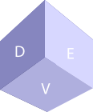

  
  

# Table Of Content
1. [Introduction](#introduction) 
2. [How to Use](#how_to_use)
3. [About us](#about_us)
4. [Privacy Policy](POLICY.md)

# Introduction
We have launched Cooldevs on 15 December 2022. Cooldevs is a multi-purpose website. You can :

- :white_check_mark: Chat with your friends :thought_balloon:
- :white_check_mark: Listen to a music :headphones:
- :white_check_mark: And many more are about to add in the future! :clipboard:

Your information is encrypted:lock:. We update this website from time to time. :watch:

*****

# How To Use
### Creating An Account
- :point_right: Go To Sign Up Section.
- :point_right: Please enter your ***REAL*** email address :email:(So that we can inform you if unexpected things happen.)
- :point_right: Enter your Password, Nickname and Birth year.
- :point_right: When you successfully sign up, you will be automatically login.
- :point_right: You can rename your nickname and profile picture anytime. :pencil2:
- :point_right: When you change your profile picture, please add the absolute URL(*This is an example of absolute URL:* `https://wikipedia.org`)
- :point_right: You can also add your biography. :wink:

### Searching Friends
- :point_right: If your friend also has an account in CoolDevs, you can find him/her too! :eyes:
- :point_right: Press Search Profile With Email, Enter his/her email address :envelope:.
- :point_right: If you type the correct email, you will find your friends! :hugs:

*****

# About us

This website is owned by <a href="https://yeaethawe.netlify.app/">Yae Thawe</a>. If you encounter unexpected errors, feel free to contact.

 

<table align=center>
<h3 align=center>Our Team</h3>
  <tr>
    <td align="center"><a href="https://github.com/Yaethwe"> <b>Yae Thwe</b></a> <a href="" title="Owner">:man_in_tuxedo:</a> <a href="" title="code">:computer:</a></td>
    <td align="center"><a href="https://github.com/NyanKaungSet"> <b>Nyan Kaung Set</b></a> <a href="" title="Member">:man_office_worker:</a> <a href="" title="code">:computer:</a></td>
  </tr>
</table> 

<b><i>Willing To Collaborate With Us? Let's Know!</i></b>

*****

<h1 align="center">
  
  
</h1>
